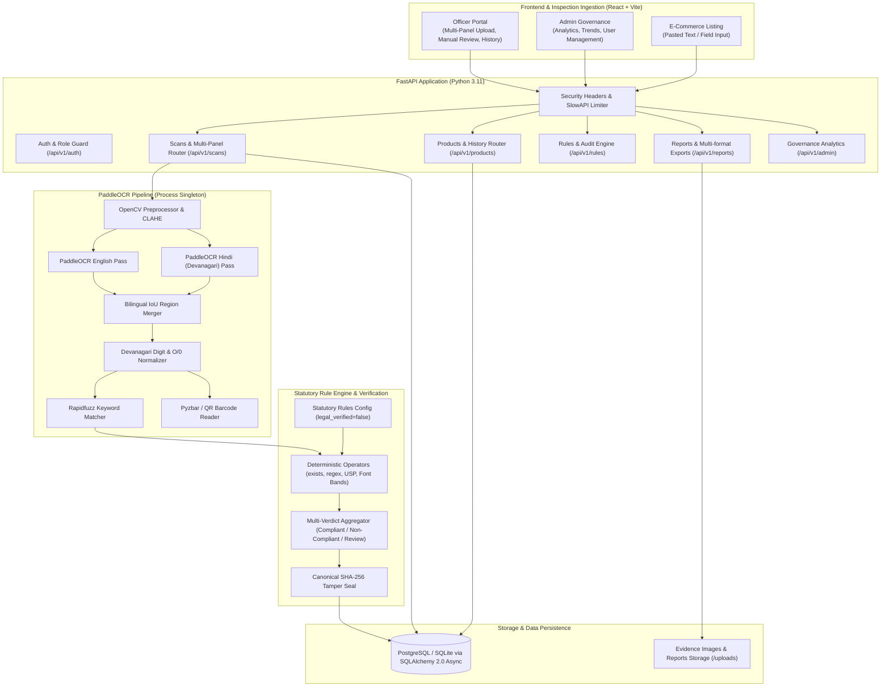
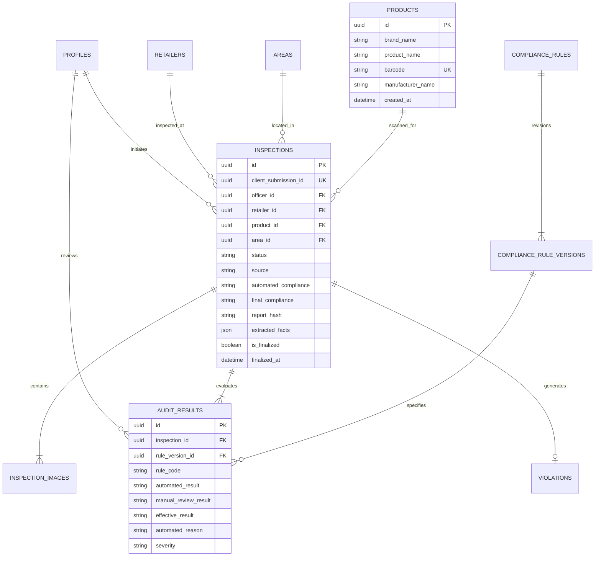

# MAARS Lens — Legal Metrology Compliance Platform
## Technical Architecture & System Overview

MAARS Lens is an automated statutory compliance verification platform built for the **Legal Metrology Act, 2009** and the **Legal Metrology (Packaged Commodities) Rules, 2011 (India)**. It inspects packaged commodity packaging images and e-commerce listings, extracts mandatory declarations, evaluates compliance, detects violations, and generates tamper-evident signed inspection certificates.

---

## 1. System Architecture & Component Diagram

---

## 2. End-to-End Data Flow

1. **Ingestion & Validation**:
   - Packaged commodity images (front, back, side panels) are uploaded with panel tags.
   - Magic bytes and SHA-256 digests are validated; original files are stored immutably.
   - For e-commerce listings, pasted catalog text or structured fields are ingested with `source="listing"`.
2. **Dual-Pass Bilingual OCR**:
   - PaddleOCR runs dual passes (`en` + `hi`) using thread-safe process singletons.
   - Regions are spatially merged using Intersection over Union (IoU) with digit preservation heuristics.
   - Hindi Devanagari numerals (`०-९ -> 0-9`) and optical confusion characters (`O` -> `0`) are normalized.
3. **Statutory Fact Extraction**:
   - Fuzzy token pattern matching (rapidfuzz) extracts mandatory fields: MRP, Tax Inclusivity, Net Quantity, Mfg/Pkd Date, Manufacturer, Country of Origin, Customer Care, and FSSAI.
   - Barcode/QR reading is extracted via `pyzbar` with graceful fallback.
4. **Rule Engine & Exemption Audit**:
   - Statutory rules loaded from database/config (`statutory_rules.json`) are evaluated against extracted facts.
   - Package exemptions (e.g. net quantity $\le$ 10g or industrial packages) are respected.
   - Calculated unit sale prices (USP) are cross-checked against MRP and Net Quantity within a 5% tolerance band.
5. **Officer Review & Cryptographic Finalization**:
   - Officers can perform justified manual assessments on contested items (server-side `effective_result`).
   - Finalization marks the inspection immutable and seals it with a canonical SHA-256 hash.
   - Reports are exported as bilingual Hindi PDF with verification QR code, DOCX, and XLSX.

---

## 3. Entity-Relationship Data Model

---

## 4. User Roles & RBAC Matrix

| Role | Permitted Actions | Restrictions |
|:---|:---|:---|
| **Officer** | Upload scans, evaluate OCR, conduct manual review, seal inspections, view product history, issue violation notices | Cannot view/modify draft inspections belonging to other officers; cannot access admin user management or global settings |
| **Admin** | View system overview analytics, trend charts, download sanitized CSV exports, activate/deactivate user profiles | Cannot deactivate self (self-lockout guard); cannot delete immutable statutory records |
| **Retailer** | View finalized inspection outcomes and statutory violation notices issued against their registered retail entity | Cannot modify inspection results or access other retailers' records |
| **Customer** | Submit public complaints, view public verified compliance registers | Cannot access officer inspection notes, internal coordinates, or officer UUIDs |

---

## 5. Known Limitations & Prototype Boundaries

1. **Docker / Containerization Status: UNVERIFIED**:
   - `Dockerfile` and `docker-compose.yml` configurations are provided in the repository, but Docker daemon is **not installed on the host evaluation environment**. Containerized deployment has not been verified in runtime; local execution on Python 3.11 (`.venv-ocr`) is the verified runtime.
2. **Cryptographic Tamper-Seal (Canonical SHA-256)**:
   - When an inspection is finalized, the system serializes a sorted canonical JSON dictionary of `{inspection_id, client_submission_id, officer_id, product_name, brand_name, automated_compliance, final_compliance, audit_results}` and computes a deterministic `sha256:{digest}` hash. Keyed HMAC is not used in the offline prototype; integrity is guaranteed by immutable SHA-256 content hashing and database finalization locks.
3. **Rule Verification Status (`legal_verified=false`)**:
   - Statutory thresholds and rule citations in `statutory_rules.json` and UI displays are draft configurations explicitly marked `legal_verified=false`. They must be formally reviewed by Legal Metrology Department legal counsel before enforcement in legal proceedings.
4. **Font Size Estimation**:
   - Camera images lack physical scale/DPI calibration. Without manual user-entered millimeter calibration dimensions, Rule 7 numeral height evaluation defaults to *"Needs Manual Review"* rather than an automated Pass/Fail. All PDF/DOCX notices display an explicit statutory disclaimer: *"Font height measurement from camera images is an estimate and requires physical gauge verification before legal proceedings."*
5. **Field Photo Accuracy**:
   - Benchmarks are conducted exclusively on 8 self-generated synthetic label graphics. Real-world photographs with lighting glare, curvature, or wrinkles have not been systematically evaluated.
6. **Execution Mode**:
   - The application defaults to inline synchronous OCR execution (`ASYNC_OCR_ENABLED=False`) so the system runs completely self-contained without needing Celery or Redis services.
