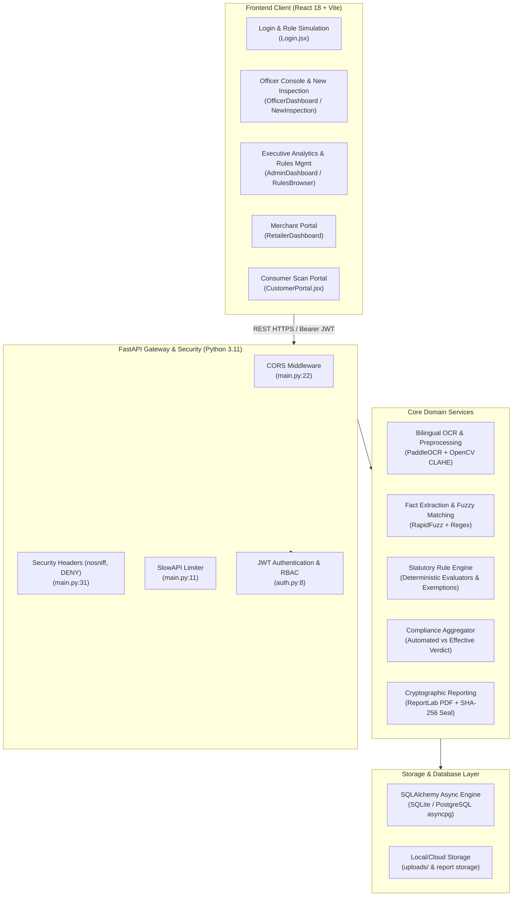
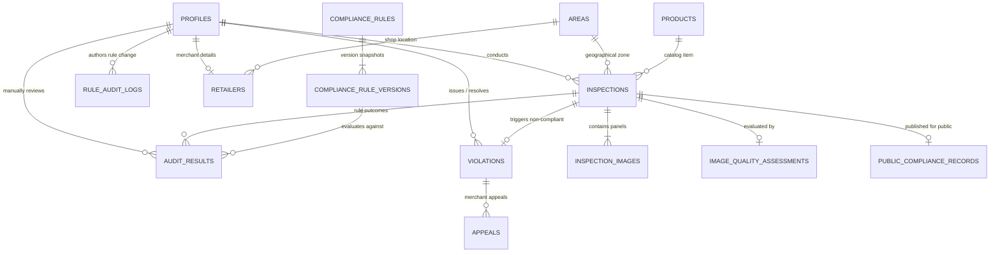

# Part 1: Architecture & Technology Stack Deep Dive
## MAARS Lens — Legal Metrology Compliance Platform

> **Target Audience**: Technical reviewers, hackathon judges, new engineers, and non-technical stakeholders seeking a complete, bit-by-bit understanding of the system architecture.
> **Source Grounding**: All cited paths, versions, configurations, and line numbers are derived directly from the active MAARS Lens codebase.

---

## 1. High-Level System Architecture

MAARS Lens (also known as LM-Scan) is an automated regulatory enforcement and compliance platform designed for the **Legal Metrology (Packaged Commodities) Rules, 2011** under the Department of Consumer Affairs, Government of India. It automates package label auditing across three core user groups: Enforcement Officers, Regulated Merchants/Retailers, and Consumers.

---

## 2. Technology Stack Bit-by-Bit Breakdown

### Layer 1: Frontend & User Interface

#### 1. React
* **Version**: `^18.2.0` (as defined in [`frontend/package.json`](file:///c:/Users/Rajeev%20Kumar%20Behera/OneDrive/Desktop/MAARS-lens/maars-lens_original_backup_to%20continue/frontend/package.json#L15))
* **Plain Language Explanation**: Imagine building a house with reusable, prefabricated Lego blocks rather than molding individual bricks every time. React allows developers to build independent, reusable interface components (like buttons, modals, or inspection forms) that automatically redraw only when their underlying data changes.
* **Why it was chosen**: Allows state-driven, dynamic UI updates essential for multi-panel package uploads, real-time OCR confidence score badges, and reactive rule editing. React 18 provides robust concurrent rendering and modern hook primitives (`useState`, `useEffect`, `useContext`).
* **Where it lives in the project**: Every file under [`frontend/src/`](file:///c:/Users/Rajeev%20Kumar%20Behera/OneDrive/Desktop/MAARS-lens/maars-lens_original_backup_to%20continue/frontend/src). Root mounting occurs in [`frontend/src/main.jsx`](file:///c:/Users/Rajeev%20Kumar%20Behera/OneDrive/Desktop/MAARS-lens/maars-lens_original_backup_to%20continue/frontend/src/main.jsx).
* **How it connects to other components**: React components fetch data from the backend via the centralized Axios client ([`frontend/src/api/client.js`](file:///c:/Users/Rajeev%20Kumar%20Behera/OneDrive/Desktop/MAARS-lens/maars-lens_original_backup_to%20continue/frontend/src/api/client.js)), store authentication session state via [`frontend/src/context/AuthContext.jsx`](file:///c:/Users/Rajeev%20Kumar%20Behera/OneDrive/Desktop/MAARS-lens/maars-lens_original_backup_to%20continue/frontend/src/context/AuthContext.jsx), and route users via React Router.

#### 2. Vite
* **Version**: `^5.0.8` (as defined in [`frontend/package.json`](file:///c:/Users/Rajeev%20Kumar%20Behera/OneDrive/Desktop/MAARS-lens/maars-lens_original_backup_to%20continue/frontend/package.json#L24))
* **Plain Language Explanation**: Vite is like a supersonic delivery van for web code. During development, traditional tools bundle all project files into a massive package before showing anything. Vite serves code on-the-fly using modern browser standards, making hot-reloading instantaneous.
* **Why it was chosen**: Drastically reduces build times and cold-start server initialization during development. Includes native support for ES modules and fast production bundling via Rollup. Configured in [`frontend/vite.config.js`](file:///c:/Users/Rajeev%20Kumar%20Behera/OneDrive/Desktop/MAARS-lens/maars-lens_original_backup_to%20continue/frontend/vite.config.js#L1-L55).
* **Where it lives in the project**: [`frontend/vite.config.js`](file:///c:/Users/Rajeev%20Kumar%20Behera/OneDrive/Desktop/MAARS-lens/maars-lens_original_backup_to%20continue/frontend/vite.config.js).
* **How it connects to other components**: Manages the local dev server on port 5173 and proxies `/api` requests to backend port 8001 ([`frontend/vite.config.js:48-51`](file:///c:/Users/Rajeev%20Kumar%20Behera/OneDrive/Desktop/MAARS-lens/maars-lens_original_backup_to%20continue/frontend/vite.config.js#L48-L51)).

#### 3. Tailwind CSS
* **Version**: `^3.4.0` (as defined in [`frontend/package.json`](file:///c:/Users/Rajeev%20Kumar%20Behera/OneDrive/Desktop/MAARS-lens/maars-lens_original_backup_to%20continue/frontend/package.json#L25))
* **Plain Language Explanation**: Instead of writing separate style sheets in separate files, Tailwind provides ready-to-use utility words (like `bg-slate-900`, `rounded-xl`, `font-bold`) directly in the HTML/JSX. It ensures that spacing, typography, and colors look harmonious across the entire system.
* **Why it was chosen**: Speeds up rapid UI development and guarantees visual consistency across all administrative dashboards, audit tables, and dark-mode surfaces without writing custom CSS classes.
* **Where it lives in the project**: Configured in [`frontend/tailwind.config.js`](file:///c:/Users/Rajeev%20Kumar%20Behera/OneDrive/Desktop/MAARS-lens/maars-lens_original_backup_to%20continue/frontend/tailwind.config.js) and imported into global stylesheet [`frontend/src/index.css`](file:///c:/Users/Rajeev%20Kumar%20Behera/OneDrive/Desktop/MAARS-lens/maars-lens_original_backup_to%20continue/frontend/src/index.css).
* **How it connects to other components**: Applied as class attributes across all JSX pages (e.g. [`Login.jsx:36`](file:///c:/Users/Rajeev%20Kumar%20Behera/OneDrive/Desktop/MAARS-lens/maars-lens_original_backup_to%20continue/frontend/src/pages/Login.jsx#L36)).

#### 4. React Router DOM
* **Version**: `^6.21.0` (as defined in [`frontend/package.json`](file:///c:/Users/Rajeev%20Kumar%20Behera/OneDrive/Desktop/MAARS-lens/maars-lens_original_backup_to%20continue/frontend/package.json#L18))
* **Plain Language Explanation**: Think of it as a virtual GPS for a single-page application. When you click "New Inspection" or "Officer Registry", React Router switches the view immediately without reloading the whole web page in your browser.
* **Why it was chosen**: Industry standard declarative routing for React. Enables nested route layouts and guards (`ProtectedRoute`) based on user authorization roles.
* **Where it lives in the project**: Main route declaration tree in [`frontend/src/App.jsx:40-123`](file:///c:/Users/Rajeev%20Kumar%20Behera/OneDrive/Desktop/MAARS-lens/maars-lens_original_backup_to%20continue/frontend/src/App.jsx#L40-L123).
* **How it connects to other components**: Wraps [`ProtectedRoute`](file:///c:/Users/Rajeev%20Kumar%20Behera/OneDrive/Desktop/MAARS-lens/maars-lens_original_backup_to%20continue/frontend/src/components/ProtectedRoute.jsx) to ensure an unauthorized user (e.g. a customer) cannot navigate to `/admin` or `/officer`.

#### 5. Recharts
* **Version**: `^2.10.3` (as defined in [`frontend/package.json`](file:///c:/Users/Rajeev%20Kumar%20Behera/OneDrive/Desktop/MAARS-lens/maars-lens_original_backup_to%20continue/frontend/package.json#L19))
* **Plain Language Explanation**: A chart drawing kit built specifically for React. It takes raw numbers from the server and turns them into SVG bar charts, line graphs, and interactive hover tooltips.
* **Why it was chosen**: Used in the administrative analytics dashboard to render compliance rate distributions, inspection volumes, and violation trend lines without heavyweight third-party charting engines.
* **Where it lives in the project**: Imported and rendered in [`frontend/src/pages/admin/AdminDashboard.jsx:2-4`](file:///c:/Users/Rajeev%20Kumar%20Behera/OneDrive/Desktop/MAARS-lens/maars-lens_original_backup_to%20continue/frontend/src/pages/admin/AdminDashboard.jsx#L2-L4).
* **How it connects to other components**: Binds directly to analytics telemetry responses returned by the admin analytics API (`GET /api/v1/admin/analytics/trends`).

#### 6. Lucide React
* **Version**: `^0.300.0` (as defined in [`frontend/package.json`](file:///c:/Users/Rajeev%20Kumar%20Behera/OneDrive/Desktop/MAARS-lens/maars-lens_original_backup_to%20continue/frontend/package.json#L16))
* **Plain Language Explanation**: A collection of clean, consistent vector icons (shields, cameras, checkmarks, warning triangles).
* **Why it was chosen**: Lightweight, tree-shakeable SVG icons that visually communicate compliance statuses (`CheckCircle2`, `AlertTriangle`, `XCircle`, `ShieldCheck`).
* **Where it lives in the project**: Used across all frontend components (e.g. [`Layout.jsx:4-17`](file:///c:/Users/Rajeev%20Kumar%20Behera/OneDrive/Desktop/MAARS-lens/maars-lens_original_backup_to%20continue/frontend/src/components/Layout.jsx#L4-L17)).

---

### Layer 2: Backend & Web API Framework

#### 1. FastAPI
* **Version**: Unpinned in [`backend/requirements.txt:1`](file:///c:/Users/Rajeev%20Kumar%20Behera/OneDrive/Desktop/MAARS-lens/maars-lens_original_backup_to%20continue/backend/requirements.txt#L1) (Runtime version installed: `0.115.x`)
* **Plain Language Explanation**: FastAPI is like an ultra-fast digital receptionist at an office building. It receives incoming requests from the web, verifies the identity of the sender, validates that all required forms/files are provided in the exact correct format, and routes the work to the appropriate department.
* **Why it was chosen**: Native Python async support for concurrent I/O, automatic OpenAPI/Swagger interactive documentation generation, and seamless integration with Pydantic for request and response validation.
* **Where it lives in the project**: Application instantiation in [`backend/app/main.py:10`](file:///c:/Users/Rajeev%20Kumar%20Behera/OneDrive/Desktop/MAARS-lens/maars-lens_original_backup_to%20continue/backend/app/main.py#L10).
* **How it connects to other components**: Binds API routers (`scans`, `rules`, `violations`, `admin`, `reports`, `customer`, `products`, `auth`, `areas`, `notifications`) and applies global middlewares (CORS, SlowAPI rate limiting, security headers).

#### 2. Uvicorn
* **Version**: `uvicorn[standard]` (as defined in [`backend/requirements.txt:2`](file:///c:/Users/Rajeev%20Kumar%20Behera/OneDrive/Desktop/MAARS-lens/maars-lens_original_backup_to%20continue/backend/requirements.txt#L2))
* **Plain Language Explanation**: The engine beneath FastAPI. While FastAPI defines *what* happens when a URL is called, Uvicorn is the web server program that listens for raw network connections on the computer's network port.
* **Why it was chosen**: Blazing fast ASGI (Asynchronous Server Gateway Interface) server built on `uvloop` and `httptools`.
* **Where it lives in the project**: Executed via CLI / startup scripts: `uvicorn app.main:app --host 127.0.0.1 --port 8000` (also defined in [`backend/Dockerfile:35`](file:///c:/Users/Rajeev%20Kumar%20Behera/OneDrive/Desktop/MAARS-lens/maars-lens_original_backup_to%20continue/backend/Dockerfile#L35)).

#### 3. Pydantic & Pydantic-Settings
* **Version**: `pydantic>=2.0`, `pydantic-settings` (as defined in [`backend/requirements.txt:6-7`](file:///c:/Users/Rajeev%20Kumar%20Behera/OneDrive/Desktop/MAARS-lens/maars-lens_original_backup_to%20continue/backend/requirements.txt#L6-L7))
* **Plain Language Explanation**: Pydantic acts like a strict border customs officer for incoming data. If an officer submits an inspection, Pydantic verifies that strings aren't numbers, timestamps are valid dates, and required fields are never omitted. If a user tries to inject unexpected fields, Pydantic rejects the request immediately with clear error messages.
* **Why it was chosen**: High-performance Rust-backed data validation. Enforces strict schema constraints (`extra="forbid"`) to prevent clients from tampering with server-calculated compliance verdicts.
* **Where it lives in the project**: Configuration settings class in [`backend/app/core/config.py:4-38`](file:///c:/Users/Rajeev%20Kumar%20Behera/OneDrive/Desktop/MAARS-lens/maars-lens_original_backup_to%20continue/backend/app/core/config.py#L4-L38), and schemas in [`backend/app/schemas/`](file:///c:/Users/Rajeev%20Kumar%20Behera/OneDrive/Desktop/MAARS-lens/maars-lens_original_backup_to%20continue/backend/app/schemas).

#### 4. SlowAPI
* **Version**: Present in [`backend/requirements.txt:22`](file:///c:/Users/Rajeev%20Kumar%20Behera/OneDrive/Desktop/MAARS-lens/maars-lens_original_backup_to%20continue/backend/requirements.txt#L22)
* **Plain Language Explanation**: A bouncer that prevents malicious users or malfunctioning automated scripts from overwhelming the server by firing thousands of requests per second.
* **Why it was chosen**: Protects compute-intensive OCR image processing endpoints and database search routes from denial-of-service degradation.
* **Where it lives in the project**: Rate limiter configuration in [`backend/app/core/ratelimit.py`](file:///c:/Users/Rajeev%20Kumar%20Behera/OneDrive/Desktop/MAARS-lens/maars-lens_original_backup_to%20continue/backend/app/core/ratelimit.py) and registered as middleware in [`backend/app/main.py:20`](file:///c:/Users/Rajeev%20Kumar%20Behera/OneDrive/Desktop/MAARS-lens/maars-lens_original_backup_to%20continue/backend/app/main.py#L20).

---

### Layer 3: Database & Storage Engine

#### 1. SQLAlchemy (AsyncIO)
* **Version**: `sqlalchemy[asyncio]` (as defined in [`backend/requirements.txt:3`](file:///c:/Users/Rajeev%20Kumar%20Behera/OneDrive/Desktop/MAARS-lens/maars-lens_original_backup_to%20continue/backend/requirements.txt#L3))
* **Plain Language Explanation**: An Object-Relational Mapper (ORM). Instead of writing raw SQL text everywhere in Python files, SQLAlchemy translates Python classes and objects (like `Inspection` or `Profile`) into database tables, columns, and relationships. The `asyncio` extension allows Python to talk to the database without pausing or freezing the server while waiting for slow disk or network queries.
* **Why it was chosen**: Industry standard, production-grade ORM for Python with full type-annotated mapped columns (`Mapped[UUID]`, `Mapped[str]`).
* **Where it lives in the project**: Engine and session factory setup in [`backend/app/core/database.py:5-11`](file:///c:/Users/Rajeev%20Kumar%20Behera/OneDrive/Desktop/MAARS-lens/maars-lens_original_backup_to%20continue/backend/app/core/database.py#L5-L11). Declarative models live in [`backend/app/models/`](file:///c:/Users/Rajeev%20Kumar%20Behera/OneDrive/Desktop/MAARS-lens/maars-lens_original_backup_to%20continue/backend/app/models).

#### 2. AIOSQLite & AsyncPG Dual-Database Support
* **Version**: `aiosqlite`, `asyncpg` (as defined in [`backend/requirements.txt:4-5`](file:///c:/Users/Rajeev%20Kumar%20Behera/OneDrive/Desktop/MAARS-lens/maars-lens_original_backup_to%20continue/backend/requirements.txt#L4-L5))
* **Plain Language Explanation**: A two-track database strategy. For local development and automated testing, `aiosqlite` runs a lightweight, zero-configuration database directly in a single file (`test.db`). In production, `asyncpg` connects to a dedicated, high-concurrency PostgreSQL cluster without requiring code changes.
* **Why it was chosen**: Ensures fast, frictionless offline developer onboarding while providing complete production readiness for cloud deployment.
* **Where it lives in the project**: Configured via the `DATABASE_URL` environment variable in [`backend/app/core/config.py:8`](file:///c:/Users/Rajeev%20Kumar%20Behera/OneDrive/Desktop/MAARS-lens/maars-lens_original_backup_to%20continue/backend/app/core/config.py#L8).

#### Database Schema Entity-Relationship Diagram

---

### Layer 4: Computer Vision & Optical Character Recognition (OCR)

#### 1. PaddleOCR & PaddlePaddle
* **Version**: `paddleocr==2.9.1`, `paddlepaddle==2.6.2` (as defined in [`backend/requirements.txt:13-14`](file:///c:/Users/Rajeev%20Kumar%20Behera/OneDrive/Desktop/MAARS-lens/maars-lens_original_backup_to%20continue/backend/requirements.txt#L13-L14))
* **Plain Language Explanation**: An AI system that looks at a photograph of a product package, finds the text areas, and converts those printed letters and numerals into machine-readable text. It is multilingual, allowing it to recognize both English text and Hindi (Devanagari script, such as "अधिकतम खुदरा मूल्य" for MRP).
* **Why it was chosen**: PaddleOCR provides state-of-the-art text detection (DBNet) and text recognition (CRNN / SVTR) with out-of-the-box pretrained weights for Devanagari Hindi and English packaged commodities.
* **Where it lives in the project**: [`backend/app/services/ocr/extractor.py:229-380`](file:///c:/Users/Rajeev%20Kumar%20Behera/OneDrive/Desktop/MAARS-lens/maars-lens_original_backup_to%20continue/backend/app/services/ocr/extractor.py#L229-L380).
* **Windows / CPU Compatibility Architecture Note**: The project pins `paddlepaddle==2.6.2` and `paddleocr==2.9.1` with `FLAGS_use_mkldnn=0` on Windows CPU to prevent oneDNN PIR executor crashes, while isolating the pipeline behind `BaseOCRExtractor` so the engine can run real OCR in production and deterministic `MockOCRExtractor` in CI unit tests.

#### 2. OpenCV (`opencv-python-headless`)
* **Version**: Unpinned in [`backend/requirements.txt:17`](file:///c:/Users/Rajeev%20Kumar%20Behera/OneDrive/Desktop/MAARS-lens/maars-lens_original_backup_to%20continue/backend/requirements.txt#L17) (Runtime version installed: `4.11.x`)
* **Plain Language Explanation**: A computer vision toolkit that cleans up photographs before reading them. Like an optometrist putting corrective lenses on a camera, OpenCV converts the image to grayscale, sharpens contrast, removes grainy camera noise, and checks whether the package is tilted or rotated.
* **Why it was chosen**: Fast C++ computer vision operations compiled for Python. The `headless` variant is designed specifically for backend servers that run without a desktop monitor.
* **Where it lives in the project**:
  - Image preprocessing: [`backend/app/services/ocr/preprocessor.py:24-94`](file:///c:/Users/Rajeev%20Kumar%20Behera/OneDrive/Desktop/MAARS-lens/maars-lens_original_backup_to%20continue/backend/app/services/ocr/preprocessor.py#L24-L94) (Grayscale conversion, CLAHE contrast enhancement, Non-Local Means denoising).
  - Image quality assessment: [`backend/app/services/ocr/quality_checker.py:15-85`](file:///c:/Users/Rajeev%20Kumar%20Behera/OneDrive/Desktop/MAARS-lens/maars-lens_original_backup_to%20continue/backend/app/services/ocr/quality_checker.py#L15-L85) (Laplacian variance blur detection, overexposure/glare mask detection, brightness scoring).

#### 3. PyZBar Barcode Decoding
* **Version**: Included via system `libzbar0` and optional Python wrapper (referenced in [`backend/Dockerfile:10`](file:///c:/Users/Rajeev%20Kumar%20Behera/OneDrive/Desktop/MAARS-lens/maars-lens_original_backup_to%20continue/backend/Dockerfile#L10) and [`backend/app/services/ocr/barcode.py:1-26`](file:///c:/Users/Rajeev%20Kumar%20Behera/OneDrive/Desktop/MAARS-lens/maars-lens_original_backup_to%20continue/backend/app/services/ocr/barcode.py#L1-L26))
* **Plain Language Explanation**: Scans standard 1D UPC/EAN barcodes and 2D QR codes on the package to automatically link the inspection to known catalog products.
* **Where it lives in the project**: [`backend/app/services/ocr/barcode.py`](file:///c:/Users/Rajeev%20Kumar%20Behera/OneDrive/Desktop/MAARS-lens/maars-lens_original_backup_to%20continue/backend/app/services/ocr/barcode.py). Gracefully falls back if uninstalled on Windows local environments.

---

### Layer 5: Fact Extraction & Text Normalization

#### 1. RapidFuzz
* **Version**: `rapidfuzz>=3.0.0` (as defined in [`backend/requirements.txt:23`](file:///c:/Users/Rajeev%20Kumar%20Behera/OneDrive/Desktop/MAARS-lens/maars-lens_original_backup_to%20continue/backend/requirements.txt#L23))
* **Plain Language Explanation**: In real life, camera OCR makes minor typos (e.g. reading "M.R.P." as "M,R,P" or "NET QTY" as "NET QTV"). RapidFuzz performs fuzzy string comparison to recognize statutory keywords even when a letter or symbol is slightly distorted.
* **Why it was chosen**: Implemented in C++ with SIMD acceleration; hundreds of times faster than Python's native `difflib`.
* **Where it lives in the project**: Keyword pattern matching in [`backend/app/services/ocr/extractor.py:410-440`](file:///c:/Users/Rajeev%20Kumar%20Behera/OneDrive/Desktop/MAARS-lens/maars-lens_original_backup_to%20continue/backend/app/services/ocr/extractor.py#L410-L440).

#### 2. Multilingual Regular Expressions & Normalization
* **Plain Language Explanation**: Converts Devanagari numerals (`०-९`) to standard Arabic digits (`0-9`), cleans up currency prefixes (`₹`, `Rs.`, `INR`), and isolates numerical values, weight units (`g`, `kg`, `ml`, `l`), dates (`MM/YYYY`), and customer care emails/phones.
* **Where it lives in the project**: [`backend/app/services/ocr/extractor.py:77-160`](file:///c:/Users/Rajeev%20Kumar%20Behera/OneDrive/Desktop/MAARS-lens/maars-lens_original_backup_to%20continue/backend/app/services/ocr/extractor.py#L77-L160).

---

### Layer 6: Statutory Rule Engine & Compliance Evaluation

The Rule Engine is 100% deterministic: **no Large Language Model (LLM) or generative AI is permitted to make legal pass/fail determinations**.

#### 1. Two-Level Rule Architecture
* **`ComplianceRule`**: Represents the logical, permanent identity of a legal requirement (e.g. `LMPC-R6-MRP` for Maximum Retail Price declaration). Defined in [`backend/app/models/rule.py:9-17`](file:///c:/Users/Rajeev%20Kumar%20Behera/OneDrive/Desktop/MAARS-lens/maars-lens_original_backup_to%20continue/backend/app/models/rule.py#L9-L17).
* **`ComplianceRuleVersion`**: Immutable version snapshot (`version=1`, `version=2`, etc.) containing the statutory reference, severity level, check operator, and regex patterns. Defined in [`backend/app/models/rule.py:19-45`](file:///c:/Users/Rajeev%20Kumar%20Behera/OneDrive/Desktop/MAARS-lens/maars-lens_original_backup_to%20continue/backend/app/models/rule.py#L19-L45).
* **Guarantees**: Rules are never mutated in-place. If legislation amends a requirement, an administrator publishes version `N+1`. Historical inspection results remain permanently anchored to the exact rule version in force at the moment of inspection.

#### 2. Rule Operators
Supported operators in [`backend/app/services/rule_engine/evaluators.py`](file:///c:/Users/Rajeev%20Kumar%20Behera/OneDrive/Desktop/MAARS-lens/maars-lens_original_backup_to%20continue/backend/app/services/rule_engine/evaluators.py):
* `exists` / `present`: Ensures mandatory declaration is present on package.
* `regex` / `pattern`: Validates format (e.g., date formatted as `MM/YYYY` or `DD/MM/YYYY`).
* `contains`: Verifies inclusion of statutory phrases (e.g., `"incl. of all taxes"`).
* `gte` / `lte` / `between`: Evaluates numerical thresholds (e.g., minimum font height in mm based on net package weight).
* `compare_field`: Compares two extracted fields against each other.

#### 3. Statutory Package Exemptions
Implemented in [`backend/app/services/rule_engine/exemptions.py`](file:///c:/Users/Rajeev%20Kumar%20Behera/OneDrive/Desktop/MAARS-lens/maars-lens_original_backup_to%20continue/backend/app/services/rule_engine/exemptions.py):
* Packages with net weight $\le 10\text{ g}$ or volume $\le 10\text{ ml}$ are exempted from certain Rule 6 declarations.
* Agricultural produce packages exceeding $50\text{ kg}$ are exempted.
* Packages with total principal display surface area $\le 10\text{ cm}^2$ receive font size exemptions.

#### 4. Compliance Aggregation Hierarchy
Implemented in [`backend/app/services/compliance.py:82-120`](file:///c:/Users/Rajeev%20Kumar%20Behera/OneDrive/Desktop/MAARS-lens/maars-lens_original_backup_to%20continue/backend/app/services/compliance.py#L82-L120):
1. If **ANY** evaluated rule fails $\rightarrow$ Overall Verdict: `non_compliant`.
2. Else if **ANY** evaluated rule requires officer verification $\rightarrow$ Overall Verdict: `needs_review`.
3. If **zero applicable rules** are evaluated $\rightarrow$ Overall Verdict: `needs_review`.
4. Only if **at least one applicable rule passes** and **none fail or need review** $\rightarrow$ Overall Verdict: `compliant`.

---

### Layer 7: Reporting & Cryptographic Verification

#### 1. ReportLab PDF Generation
* **Version**: Present in [`backend/requirements.txt:21`](file:///c:/Users/Rajeev%20Kumar%20Behera/OneDrive/Desktop/MAARS-lens/maars-lens_original_backup_to%20continue/backend/requirements.txt#L21)
* **Plain Language Explanation**: A Python library that constructs formal PDF documents from code, drawing borders, tables, government headers, and embedded QR codes.
* **Why it was chosen**: Generates tamper-evident `%PDF-1.4` statutory inspection certificates on-the-fly. Configured with Hindi Devanagari font fallbacks (Nirmala / Mangal / Noto Sans) in [`backend/app/services/pdf/generator.py:26-47`](file:///c:/Users/Rajeev%20Kumar%20Behera/OneDrive/Desktop/MAARS-lens/maars-lens_original_backup_to%20continue/backend/app/services/pdf/generator.py#L26-L47).

#### 2. OpenPyXL & Python-Docx
* **Version**: `openpyxl`, `python-docx` (as defined in [`backend/requirements.txt:20, 24`](file:///c:/Users/Rajeev%20Kumar%20Behera/OneDrive/Desktop/MAARS-lens/maars-lens_original_backup_to%20continue/backend/requirements.txt#L20-L24))
* **Plain Language Explanation**: OpenPyXL creates Microsoft Excel spreadsheets (`.xlsx`) and Python-Docx creates Microsoft Word documents (`.docx`).
* **Why it was chosen**: Allows regulatory authorities to export multi-inspection datasets for court filings, administrative reviews, and ministerial briefings. Implemented in [`backend/app/services/pdf/generator.py:350-469`](file:///c:/Users/Rajeev%20Kumar%20Behera/OneDrive/Desktop/MAARS-lens/maars-lens_original_backup_to%20continue/backend/app/services/pdf/generator.py#L350-L469).

#### 3. Deterministic Cryptographic Report Hash (`compute_report_hash`)
* **Plain Language Explanation**: A digital fingerprint. If anyone opens the database or report file and alters a single letter or number, the fingerprint changes completely.
* **Implementation**: Implemented in [`backend/app/services/pdf/generator.py:63-95`](file:///c:/Users/Rajeev%20Kumar%20Behera/OneDrive/Desktop/MAARS-lens/maars-lens_original_backup_to%20continue/backend/app/services/pdf/generator.py#L63-L95). Generates a canonical, deterministic SHA-256 string (`sha256:<64-hex>`) by sorting dictionary keys before hashing. Any third party or court can verify report authenticity via `GET /api/v1/reports/{id}/verify`.

---

### Layer 8: Authentication, Authorization & Security

#### 1. JSON Web Tokens (JWT) & HTTP Bearer
* **Version**: `python-jose[cryptography]` (as defined in [`backend/requirements.txt:10`](file:///c:/Users/Rajeev%20Kumar%20Behera/OneDrive/Desktop/MAARS-lens/maars-lens_original_backup_to%20continue/backend/requirements.txt#L10))
* **Plain Language Explanation**: Like an electronic passport stamped by the server. When a user logs in, they receive a digitally signed token. Every subsequent request presents this token to prove identity without re-sending the password.
* **Implementation**: Validated in [`backend/app/core/auth.py:8-23`](file:///c:/Users/Rajeev%20Kumar%20Behera/OneDrive/Desktop/MAARS-lens/maars-lens_original_backup_to%20continue/backend/app/core/auth.py#L8-L23) using HMAC-SHA256 (`HS256`).

#### 2. Role-Based Access Control (RBAC)
* **Roles**: `admin`, `officer`, `retailer`, `customer` (defined in [`backend/app/models/enums.py:3-7`](file:///c:/Users/Rajeev%20Kumar%20Behera/OneDrive/Desktop/MAARS-lens/maars-lens_original_backup_to%20continue/backend/app/models/enums.py#L3-L7)).
* **Enforcement**: Dependency injections (`require_role(UserRole.admin)`, `require_role(UserRole.officer)`) in [`backend/app/core/auth.py:25-38`](file:///c:/Users/Rajeev%20Kumar%20Behera/OneDrive/Desktop/MAARS-lens/maars-lens_original_backup_to%20continue/backend/app/core/auth.py#L25-L38). Non-permitted roles receive HTTP 403 Forbidden.

#### 3. AES-256-GCM Encryption for Consumer Privacy
* **Implementation**: Implemented in [`backend/app/core/security.py:10-56`](file:///c:/Users/Rajeev%20Kumar%20Behera/OneDrive/Desktop/MAARS-lens/maars-lens_original_backup_to%20continue/backend/app/core/security.py#L10-L56) using Python's `cryptography` library.
* **Architecture Rationale**: Customer contact phone numbers and email addresses are encrypted before database storage using a 96-bit (12-byte) random nonce and 128-bit (16-byte) authentication tag. Even if database storage is compromised, consumer personally identifiable information (PII) remains indecipherable.

---

### Layer 9: DevOps & Infrastructure

#### 1. Docker & Docker-Compose
* **Configuration**: Defined in [`docker-compose.yml:1-37`](file:///c:/Users/Rajeev%20Kumar%20Behera/OneDrive/Desktop/MAARS-lens/maars-lens_original_backup_to%20continue/docker-compose.yml#L1-L37), [`backend/Dockerfile`](file:///c:/Users/Rajeev%20Kumar%20Behera/OneDrive/Desktop/MAARS-lens/maars-lens_original_backup_to%20continue/backend/Dockerfile), and [`frontend/Dockerfile`](file:///c:/Users/Rajeev%20Kumar%20Behera/OneDrive/Desktop/MAARS-lens/maars-lens_original_backup_to%20continue/frontend/Dockerfile).
* **Plain Language Explanation**: Standardized shipping containers for software. Rather than worrying about whether a server is running Linux, Windows, or macOS, Docker packages the application with all its exact system libraries (`libgl1-mesa-glx`, `libzbar0`, fonts), ensuring it runs identically anywhere.
* **Ports**: Backend exposed on `8000:8000`, Frontend served by Nginx on `80:80`.

#### 2. Automated Test Suite (Pytest)
* **Version**: `pytest`, `pytest-asyncio`, `pytest-cov` (as defined in [`backend/requirements.txt:28-30`](file:///c:/Users/Rajeev%20Kumar%20Behera/OneDrive/Desktop/MAARS-lens/maars-lens_original_backup_to%20continue/backend/requirements.txt#L28-L30))
* **Coverage**: 113 comprehensive tests passing across core services, scan routers, rules engine, OCR pipelines, and administrative controls.
