# Part 2: User Interface & Experience Walkthrough
## MAARS Lens — Legal Metrology Compliance Platform

> **Target Audience**: Technical reviewers, hackathon judges, inspection officers, and new operators.
> **Source Grounding**: All routes, component structures, visual badges, and interactions are mapped directly to live React components verified against the running application.

---

## 1. Application Navigation & Role-Based Entry Matrix

MAARS Lens provides a unified single-page application entry point with four distinct role-tailored workspaces governed by `ProtectedRoute` ([`frontend/src/components/ProtectedRoute.jsx`](file:///c:/Users/Rajeev%20Kumar%20Behera/OneDrive/Desktop/MAARS-lens/maars-lens_original_backup_to%20continue/frontend/src/components/ProtectedRoute.jsx)).

```mermaid
flowchart TD
    Login["Login Screen (/login)<br/>Quick Simulation Access"]
    
    Login -->|Role: officer| OfficerHome["Officer Console (/officer)"]
    Login -->|Role: admin| AdminHome["Executive Analytics (/admin)"]
    Login -->|Role: retailer| RetailerHome["Merchant Portal (/retailer)"]
    Login -->|Role: customer| CustomerHome["Consumer Portal (/customer)"]

    subgraph OfficerRoutes["Officer Workflow"]
        OfficerHome --> NewInsp["New Inspection (/officer/new-inspection)"]
        OfficerHome --> InspHist["Inspection Archive (/officer/inspections)"]
        OfficerHome --> InspDet["Inspection Details & Sign (/officer/inspections/:id)"]
        OfficerHome --> VioList["Statutory Violations (/officer/violations)"]
        OfficerHome --> RulesBrowseOff["Legal Metrology Rules (/officer/rules)"]
    end

    subgraph AdminRoutes["Admin Workflow"]
        AdminHome --> InspAudit["Inspection Audit (/admin/inspections)"]
        AdminHome --> RulesBrowseAdm["Rules Management & Versioning (/admin/rules)"]
        AdminHome --> VioReg["Violations Registry (/admin/violations)"]
        AdminHome --> OffReg["Officer Registry (/admin/officers)"]
        AdminHome --> UserReg["User Registry (/admin/users)"]
    end

    subgraph RetailerRoutes["Retailer Workflow"]
        RetailerHome --> RetRules["Compliance Advisory & Standards (/retailer/rules)"]
    end

    subgraph CustomerRoutes["Consumer Workflow"]
        CustomerHome --> CustScan["Real-Time Label Camera Scan & Audit"]
        CustomerHome --> CustRules["Consumer Rights & Standards (/customer/rules)"]
    end
```

---

## 2. Screen-by-Screen Walkthrough

---

### Screen 1: Login & Quick Role Simulation
* **URL / Route**: `/login`
* **Source Component**: [`frontend/src/pages/Login.jsx:1-167`](file:///c:/Users/Rajeev%20Kumar%20Behera/OneDrive/Desktop/MAARS-lens/maars-lens_original_backup_to%20continue/frontend/src/pages/Login.jsx#L1-L167)
* **Who Uses It**: All users (Officers, Administrators, Retailers, and Consumers).

#### Visual Layout & Elements
1. **Header & Emblem**:
   - Centered Government Shield logo in an indigo container (`w-14 h-14 bg-indigo-600 rounded-xl`).
   - Title: **MAARS Lens**; Subtitle: *Legal Metrology Compliance & Inspection Platform*.
2. **Credential Form**:
   - `Official Email Address` input field with mail icon.
   - `Password` input field with lock icon.
   - Blue action button: `Sign In to System` (with animated loading spinner during network authentication).
3. **Quick Role Simulation Access Section** ([`Login.jsx:120-155`](file:///c:/Users/Rajeev%20Kumar%20Behera/OneDrive/Desktop/MAARS-lens/maars-lens_original_backup_to%20continue/frontend/src/pages/Login.jsx#L120-L155)):
   - A 4-button quick simulation bar for frictionless demonstration:
     * **Officer**: Pre-fills `officer@maars.gov.in` + `Password123!`
     * **Admin**: Pre-fills `admin@maars.gov.in` + `Password123!`
     * **Retailer**: Pre-fills `retailer@store.in` + `Password123!`
     * **Consumer**: Pre-fills `consumer@maars.gov.in` + `Password123!`
4. **Footer**:
   - Official citation: *Government of India • Ministry of Consumer Affairs • Legal Metrology Division*.

#### User Interactions & Behind-the-Scenes Data Flow
* Clicking any simulation button pre-fills the email and password states.
* On form submit (`handleLogin`), `useAuth().login(email, password)` calls `POST /api/v1/auth/login`.
* The server responds with an access token containing the authenticated user profile and role claim.
* The frontend decodes the JWT, persists user data in local storage, and routes the user directly to their respective role portal (`/${user.role}`).

---

### Screen 2: Officer Dashboard & Console
* **URL / Route**: `/officer`
* **Source Component**: [`frontend/src/pages/officer/OfficerDashboard.jsx:1-194`](file:///c:/Users/Rajeev%20Kumar%20Behera/OneDrive/Desktop/MAARS-lens/maars-lens_original_backup_to%20continue/frontend/src/pages/officer/OfficerDashboard.jsx#L1-L194)
* **Who Uses It**: Legal Metrology Enforcement Officers.

#### Visual Layout & Elements
1. **Enforcement Banner**:
   - Displays *Field Enforcement Unit* badge with `ShieldCheck` icon.
   - Primary Call-to-Action button: `+ New Package Inspection` navigating to `/officer/new-inspection`.
2. **Real-Time Inspection Metrics Row** ([`OfficerDashboard.jsx:71-120`](file:///c:/Users/Rajeev%20Kumar%20Behera/OneDrive/Desktop/MAARS-lens/maars-lens_original_backup_to%20continue/frontend/src/pages/officer/OfficerDashboard.jsx#L71-L120)):
   - **Total Inspections**: Count of all inspections conducted by the unit.
   - **Compliant Packages**: Count of packages passing all statutory rules.
   - **Non-Compliant Violations**: Highlighted in red with warning badge.
   - **Pending Review / Finalized**: Operational backlog tracking.
3. **Recent Inspections Table**:
   - Columns: Product Name & Brand, Timestamp, Automated Verdict, Final Status, Officer Signature status, and Action button (`View Dossier`).

#### User Interactions & Behind-the-Scenes Data Flow
* On mount, calls `GET /api/v1/scans/` through `listScansApi()`.
* Automatically calculates summary metric totals directly from live database records.
* Clicking any table row opens the corresponding Inspection Dossier (`/officer/inspections/:id`).

---

### Screen 3: New Package Inspection (Multi-Panel Upload & OCR Audit)
* **URL / Route**: `/officer/new-inspection`
* **Source Component**: [`frontend/src/pages/officer/NewInspection.jsx:1-521`](file:///c:/Users/Rajeev%20Kumar%20Behera/OneDrive/Desktop/MAARS-lens/maars-lens_original_backup_to%20continue/frontend/src/pages/officer/NewInspection.jsx#L1-L521)
* **Who Uses It**: Officers executing an on-site retail inspection or e-commerce listing check.

#### Visual Layout & Elements
1. **Inspection Mode Selector**:
   - Toggle between **Physical Package Inspection** (camera/file upload) and **E-Commerce Listing Scan** (pasted web listing text and images).
2. **Metadata & Jurisdiction Form**:
   - `Product Name` and `Brand Name` input fields.
   - `Jurisdiction Area / Ward` dropdown dynamically populated from active database areas (`GET /api/v1/areas/`).
   - Package Dimensions input (Width $\times$ Height in cm) for visual font-size verification ratio calculations.
3. **Multi-Panel Image Upload Matrix** ([`NewInspection.jsx:36-65`](file:///c:/Users/Rajeev%20Kumar%20Behera/OneDrive/Desktop/MAARS-lens/maars-lens_original_backup_to%20continue/frontend/src/pages/officer/NewInspection.jsx#L36-L65)):
   - Officers can upload multiple sides of a packaged good: **Front Display Panel (PDP)**, **Back Panel**, **Side Panel**, and **Top/Bottom**.
   - Supports drag-and-drop, image preview thumbnails, and panel classification tags.
4. **Execution Action**:
   - `Run Automated Legal Metrology Audit` button.

#### User Interactions & Behind-the-Scenes Data Flow
* On submit, package photos are validated client-side and packaged as `multipart/form-data`.
* An offline-safe unique client submission UUID is generated.
* The request is dispatched to `POST /api/v1/scans/upload`.
* Backend pipeline:
  1. Image quality assessment (checks blur, glare, lighting via OpenCV).
  2. Multi-panel OCR text extraction and Devanagari translation via PaddleOCR.
  3. Structured fact parsing via RapidFuzz.
  4. Statutory rule engine execution evaluating all active Rule 6 mandates.
  5. Computes initial `automated_compliance` and redirects officer directly to the Inspection Dossier.

---

### Screen 4: Inspection Dossier, Manual Review & Cryptographic Finalization
* **URL / Route**: `/officer/inspections/:id`
* **Source Component**: [`frontend/src/pages/officer/InspectionDetails.jsx:1-744`](file:///c:/Users/Rajeev%20Kumar%20Behera/OneDrive/Desktop/MAARS-lens/maars-lens_original_backup_to%20continue/frontend/src/pages/officer/InspectionDetails.jsx#L1-L744)
* **Who Uses It**: Inspection Officers and Supervisory Admins.

#### Visual Layout & Elements
1. **Dossier Header & Tamper Seal Badge**:
   - Inspection ID, Product Identity, Timestamp, and Overall Compliance Status Badge (`COMPLIANT`, `NON-COMPLIANT`, or `NEEDS REVIEW`).
   - If finalized: Displays green lock icon, digital signature stamp, and canonical SHA-256 seal.
2. **Multi-Panel Image & OCR Evidence Viewer**:
   - Displays uploaded package images alongside recognized bounding boxes and extracted text facts.
3. **Statutory Audit Checklist Table**:
   - Lists every evaluated Rule 6 declaration:
     * Rule Code (e.g. `LMPC-R6-MRP`, `LMPC-R6-NET-QTY`, `LMPC-R6-NAME-ADDRESS`, `LMPC-R6-CONSUMER-CARE`).
     * Statutory Gazette Citation.
     * Automated Engine Result (`PASS`, `FAIL`, or `NEEDS REVIEW`).
     * Extracted Value vs. Expected Requirement.
     * OCR Recognition Confidence percentage badge.
     * Manual Override Button (`Review Verdict`).
4. **Manual Review Modal Dialog** ([`InspectionDetails.jsx:31-36`](file:///c:/Users/Rajeev%20Kumar%20Behera/OneDrive/Desktop/MAARS-lens/maars-lens_original_backup_to%20continue/frontend/src/pages/officer/InspectionDetails.jsx#L31-L36)):
   - Allows the officer to manually affirm or correct an engine verdict.
   - Enforces a mandatory non-empty justification reason (e.g. "Text was faint but clearly legible under manual magnification").
5. **Finalization & Legal Action Dock**:
   - `Finalize & Digitally Seal Inspection` button: Locks inspection immutability, binds officer cryptographic signature, and computes SHA-256 digest.
   - `Issue Statutory Violation` button (enabled only if final verdict is `non_compliant`).
   - `Download Inspection Certificate` buttons: Export as PDF (ReportLab), Word (`.docx`), or Excel (`.xlsx`).

---

### Screen 5: Statutory Violations Docket
* **URL / Route**: `/officer/violations` & `/admin/violations`
* **Source Component**: [`frontend/src/pages/officer/ViolationsList.jsx:1-274`](file:///c:/Users/Rajeev%20Kumar%20Behera/OneDrive/Desktop/MAARS-lens/maars-lens_original_backup_to%20continue/frontend/src/pages/officer/ViolationsList.jsx#L1-L274)
* **Who Uses It**: Officers and Administrators tracking legal enforcement actions.

#### Visual Layout & Elements
1. **Violation Docket Summary**:
   - Displays all active legal violations issued under Section 39 / Rule 6 of the Legal Metrology Act.
2. **Docket List Items**:
   - Product Name, Manufacturer, Infringing Rule Codes, Inspection Reference ID, and Current Docket Status (`Open`, `Under Review`, `Appealed`, `Resolved`, `Dismissed`).
3. **Resolution & Status Transition Dialog**:
   - Officers can transition open dockets to `Resolved` or `Dismissed` upon receipt of compounding fines or corrective label rectifications. Enforces mandatory resolution notes.

---

### Screen 6: Executive Oversight & Analytics Dashboard
* **URL / Route**: `/admin`
* **Source Component**: [`frontend/src/pages/admin/AdminDashboard.jsx:1-243`](file:///c:/Users/Rajeev%20Kumar%20Behera/OneDrive/Desktop/MAARS-lens/maars-lens_original_backup_to%20continue/frontend/src/pages/admin/AdminDashboard.jsx#L1-L243)
* **Who Uses It**: Senior Regulatory Directors and Chief Metrology Controllers.

#### Visual Layout & Elements
1. **Executive Telemetry Cards**:
   - Total Inspections Conducted across jurisdictions.
   - National Compliance Rate percentage.
   - Active Violation Dockets.
   - Active Statutory Rules Count.
2. **Interactive Trend Visualizations (Recharts)**:
   - Time-series bar and line charts depicting daily inspection throughput vs. non-compliant infractions over 7, 14, or 30 day windows.
3. **Data Export Utility**:
   - `Export CSV Audit Stream` button: Dispatches a streaming query to `GET /api/v1/admin/analytics/export`, downloading an anonymized, regulation-compliant CSV for external statistical analysis.

---

### Screen 7: Statutory Rules Management & Immutable Versioning
* **URL / Route**: `/admin/rules` (also accessible as read-only browser at `/officer/rules`, `/retailer/rules`, and `/customer/rules`)
* **Source Component**: [`frontend/src/pages/common/RulesBrowser.jsx:1-418`](file:///c:/Users/Rajeev%20Kumar%20Behera/OneDrive/Desktop/MAARS-lens/maars-lens_original_backup_to%20continue/frontend/src/pages/common/RulesBrowser.jsx#L1-L418)
* **Who Uses It**: Admins (for rule authoring and activation) and all other roles (for transparency and compliance guidance).

#### Visual Layout & Elements
1. **Search & Category Filters**:
   - Real-time search bar filtering across rule codes, descriptions, and statutory citations.
   - Category filters: `Mandatory Declarations`, `Net Quantity`, `Retail Price (MRP)`, `Dates`, `Consumer Care`.
2. **Rule Cards**:
   - Rule Code and Current Active Version number badge (e.g. `v1`, `v2`).
   - Verification Status: `Verified Statutory Gazette` vs `Demo Simulation Rule`.
   - Severity Level (`Critical`, `Major`, `Minor`, `Info`).
   - Check Definition Summary (operator, target field, regex pattern, threshold).
3. **Administrative Rule Editor Modal** ([`RulesBrowser.jsx:50-120`](file:///c:/Users/Rajeev%20Kumar%20Behera/OneDrive/Desktop/MAARS-lens/maars-lens_original_backup_to%20continue/frontend/src/pages/common/RulesBrowser.jsx#L50-L120)):
   - When an Admin edits a rule, the UI does NOT alter historical records in-place.
   - It pre-populates a new version publishing draft (`POST /api/v1/rules/{id}/versions`).
   - Enforces audit trail logging (`RuleAuditLog`) recording who authored the change and timestamp.

---

### Screen 8: Administrative User & Officer Registry
* **URL / Route**: `/admin/officers` & `/admin/users`
* **Source Component**: [`frontend/src/pages/admin/UserManagement.jsx:1-213`](file:///c:/Users/Rajeev%20Kumar%20Behera/OneDrive/Desktop/MAARS-lens/maars-lens_original_backup_to%20continue/frontend/src/pages/admin/UserManagement.jsx#L1-L213)
* **Who Uses It**: System Administrators.

#### Visual Layout & Elements
1. **User Roster Table**:
   - Displays User ID, Full Name, Email Address, Assigned Role (`officer`, `admin`, `retailer`, `customer`), and Account Status (`Active` vs `Deactivated`).
2. **Search & Role Filter Bar**:
   - Instant search by email or name; toggle between Officers-only or complete enterprise roster.
3. **Account Activation / Deactivation Guard** ([`UserManagement.jsx:40-60`](file:///c:/Users/Rajeev%20Kumar%20Behera/OneDrive/Desktop/MAARS-lens/maars-lens_original_backup_to%20continue/frontend/src/pages/admin/UserManagement.jsx#L40-L60)):
   - Admins can deactivate compromised or retired officer accounts.
   - **Self-Lockout Guard**: Prevents an administrator from deactivating their own currently logged-in account.

---

### Screen 9: Consumer Label Scanner & Public Portal
* **URL / Route**: `/customer`
* **Source Component**: [`frontend/src/pages/customer/CustomerPortal.jsx:1-414`](file:///c:/Users/Rajeev%20Kumar%20Behera/OneDrive/Desktop/MAARS-lens/maars-lens_original_backup_to%20continue/frontend/src/pages/customer/CustomerPortal.jsx#L1-L414)
* **Who Uses It**: Everyday consumers checking product packaging before purchasing.

#### Visual Layout & Elements
1. **Consumer Trust Banner**:
   - Welcomes the citizen with information regarding their rights under the Packaged Commodities Act.
2. **Photo Scan Upload Box**:
   - Drag-and-drop or mobile camera capture widget.
   - Front Display Panel selection.
   - Blue action button: `Analyze Package for Legal Compliance`.
3. **Instant Audit Verdict Card**:
   - Immediate color-coded verdict banner:
     * Green: **Fully Compliant Package** (all mandatory declarations found).
     * Red: **Potential Compliance Infractions Found** (clear, plain-English breakdown of missing MRP, obscured dates, or missing manufacturer addresses).
   - Guidance on consumer grievance redressal mechanisms.

---

### Screen 10: Merchant Compliance Portal
* **URL / Route**: `/retailer`
* **Source Component**: [`frontend/src/pages/retailer/RetailerDashboard.jsx:1-117`](file:///c:/Users/Rajeev%20Kumar%20Behera/OneDrive/Desktop/MAARS-lens/maars-lens_original_backup_to%20continue/frontend/src/pages/retailer/RetailerDashboard.jsx#L1-L117)
* **Who Uses It**: Shop owners, warehouse managers, and packaged goods vendors.

#### Visual Layout & Elements
1. **Merchant Advisory Banner**:
   - Educational guidelines on mandatory package labeling to prevent fines and seizures during field inspections.
2. **Self-Audit Checklist**:
   - Reference links to statutory declaration standards.
   - Store compliance inquiries tracking historical inspections conducted at the retailer's establishment.
